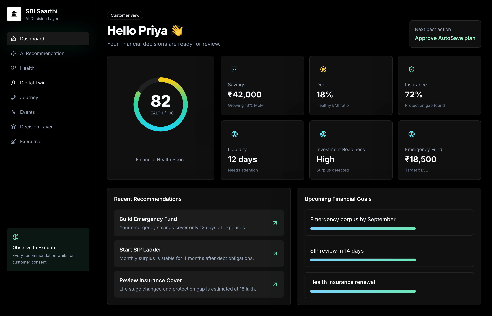
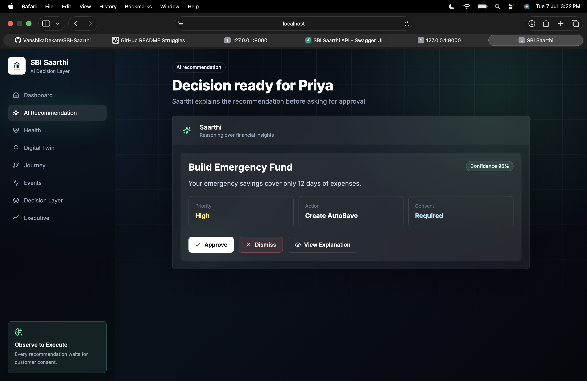
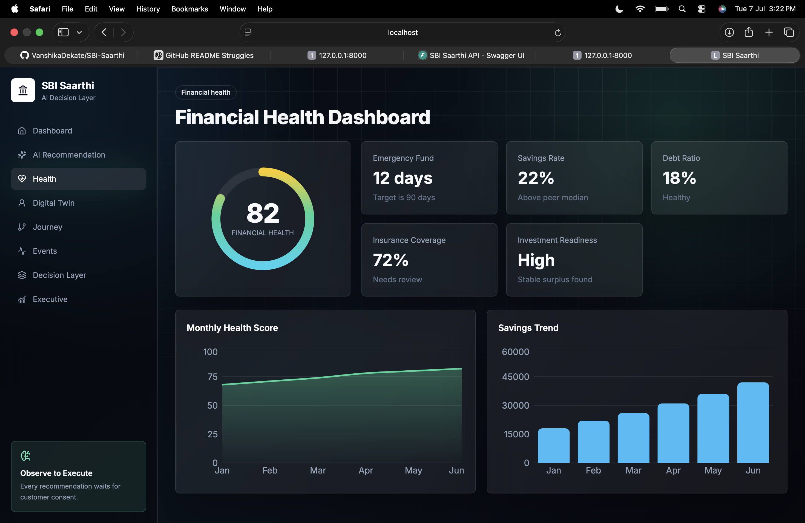
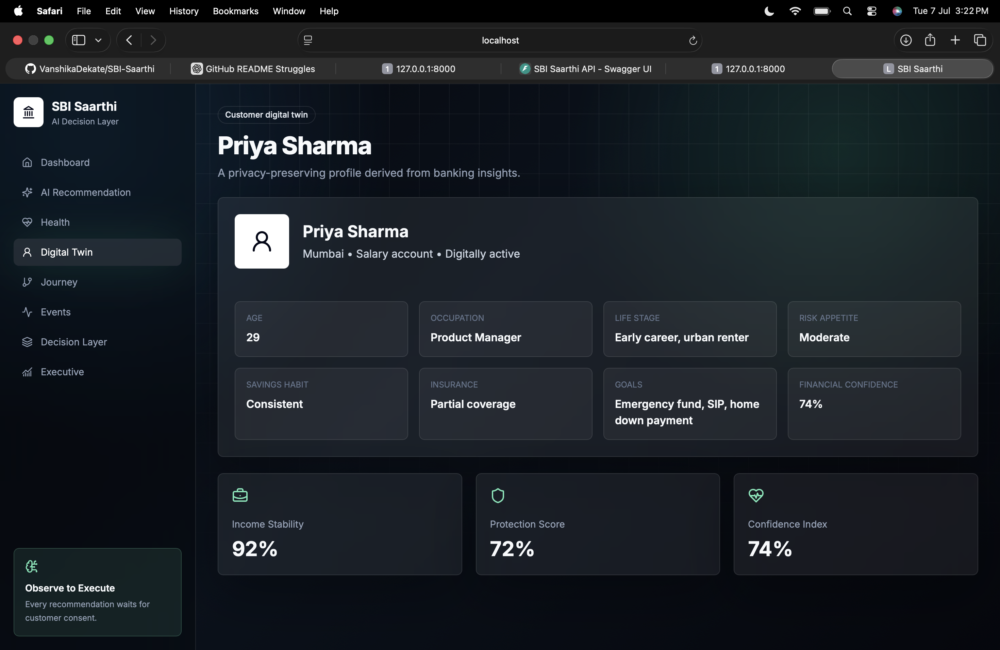
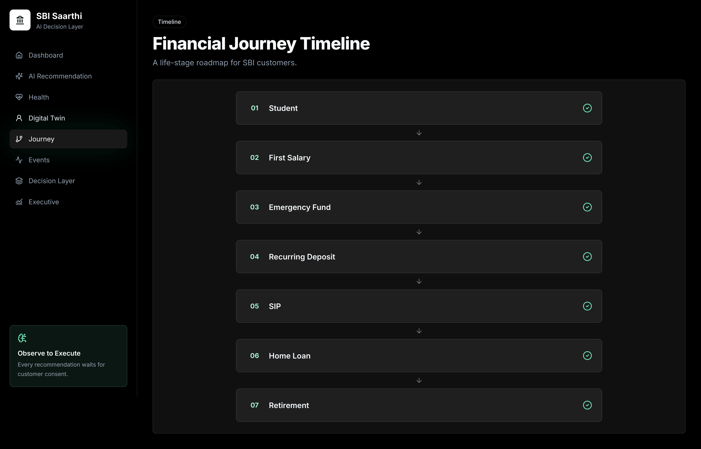
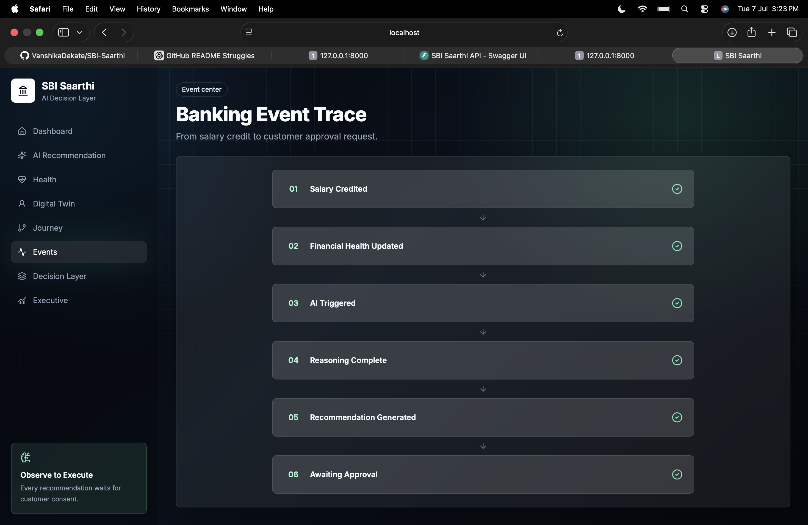
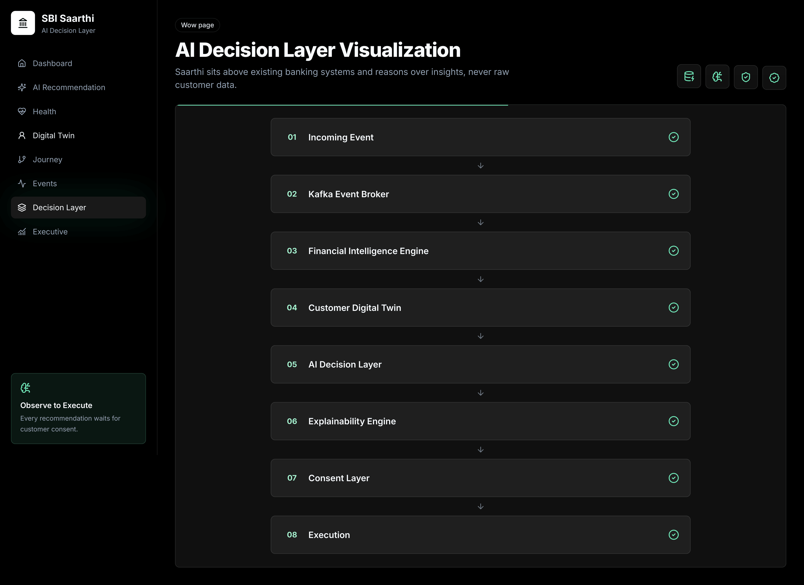
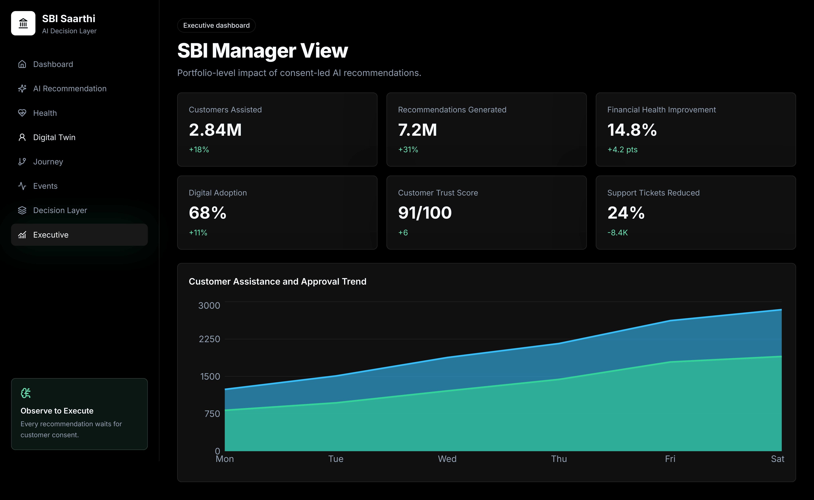

# SBI Saarthi

SBI Saarthi is a high-fidelity hackathon prototype for an AI Decision Layer in banking. It is not a production banking app and does not include real authentication, real payments, real banking APIs, databases, or live AI.

The prototype demonstrates a consent-first flow:

```text
Observe -> Reason -> Plan -> Explain -> Customer Consent -> Execute
```

## Architecture Diagram

```text
Existing Banking Systems
        |
        v
Analytics and Financial Intelligence
        |
        v
Customer Digital Twin
        |
        v
AI Decision Layer
        |
        v
Explainability Engine
        |
        v
Consent Layer
        |
        v
Dummy Execution API
```

## Features

- Premium dark fintech interface with glassmorphism, soft shadows, gradients, and micro animations
- Landing page with architecture preview and demo CTA
- Dummy login flow for hackathon recording
- Customer dashboard with financial health score, cards, recommendations, and goals
- ChatGPT-style AI recommendation page with approve, dismiss, and explanation actions
- Financial health dashboard with gauge and Recharts visualizations
- Customer Digital Twin profile page
- Animated financial journey timeline
- Banking event center timeline
- Sequential AI Decision Layer visualization
- Executive dashboard for SBI managers
- FastAPI backend with static JSON responses

## Tech Stack

Frontend:

- React
- Vite
- TypeScript
- TailwindCSS
- shadcn/ui-style reusable components
- Framer Motion
- Lucide Icons
- Recharts

Backend:

- FastAPI
- Python
- Static JSON responses
- Dummy REST APIs

## Installation

Frontend:

```bash
cd frontend
npm install
npm run dev
```

The Vite app runs at `http://localhost:5173`.

Backend:

```bash
cd backend
pip install -r requirements.txt
uvicorn app.main:app --reload
```

The FastAPI server runs at `http://127.0.0.1:8000`.

## API Endpoints

```text
GET  /dashboard
GET  /customer
GET  /financial-health
GET  /recommendation
GET  /timeline
GET  /events
GET  /executive-dashboard
POST /approve
```

Example recommendation:

```json
{
  "title": "Build Emergency Fund",
  "confidence": 96,
  "priority": "High",
  "reason": "Emergency fund covers only 12 days.",
  "action": "Create AutoSave",
  "requires_customer_consent": true
}
```

## Folder Structure

```text
SentinelX2/
├── backend/
│   ├── requirements.txt
│   └── app/
│       ├── main.py
│       ├── routers/
│       ├── models/
│       ├── schemas/
│       ├── services/
│       └── dummy_data/
├── frontend/
│   ├── index.html
│   ├── package.json
│   ├── tailwind.config.js
│   ├── vite.config.ts
│   └── src/
│       ├── App.tsx
│       ├── components/
│       ├── pages/
│       ├── lib/
│       └── data.ts
└── README.md
```

## Screenshots

### Login Page


### Dashboard


### AI Recommendation


### Financial Health


### Digital Twin


### Financial Journey


### Banking Events


### Decision Layer Visualization


### Executive Dashboard


## Future Scope

- Integrate with a governed feature store that exposes derived financial insights only
- Add explainability policies reviewed by banking compliance teams
- Add consent receipts and audit logs
- Connect to sandboxed SBI APIs for controlled demonstrations
- Add accessibility testing, localization, and mobile-first onboarding refinements
